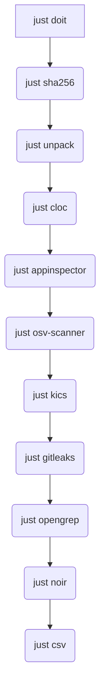

<p align="center" width="100%">
    
</p>

# baldwin.sh
[](LICENSE)
[](https://www.gnu.org/software/bash/)
[](https://github.com/pre-commit/pre-commit)

A dedicated Dev Container for your Secure Code Reviews! Make your reviews consistent, repeatable, efficient and auditable.

If you ever found yourself

- franticly pressing the arrow-up key to desperately find the correct way to launch a tool
- panicking because one hour before the report deadline you discovered that you forgot to update your toolset
- cursing at installation instructions that never work on any sane operating system
- getting angry when dependencies of one tool never agree with those of another tool
- getting nauseated when tool devs "upgrade" to a shiny new dependency manager used only by two donkeys in another universe
- having a customer demanding (6 months after the project) what version of a tool you used

then **baldwin.sh** might be a good solution.

- it logs all your manual shell interactions so you know what you did last summer
- it installs and updates your tools, and logs all versions in use
- it collects evidence for the report (e.g. SHA256 hash of received code)
- it runs one tool, or all tools and preserves old and new output
- it back-ups the project folder containing sources under review, notes, output from tools, logs,..
- it back-ups the folder with the output of all tools (for your demanding customer, or for audit reasons)

Create a folder for your project. Put the source code archive into the "/input" folder. **baldwin.sh** takes care of the rest!

[](https://ko-fi.com/igbuend)

## Features

The following tasks are automated, thanks to the [Just command runner](https://github.com/casey/just):

- **code handover**: creates a checksum (so you can proof which code you reviewed), unzips the archive, calculates the lines of code (LOC) and displays the structure of the archive.

- **technology review**: reports on technologies used and security sensitive parts of the code, like authentication, authorization, logging, ... using [Microsoft Application Inspector](https://github.com/microsoft/ApplicationInspector).

- **static code analysis**: performs a static analysis using [OpenGrep](https://github.com/opengrep/opengrep) and reports on detected vulnerabilities.

- **static code analysis of Infrastructure as Code (IaC)**: performs a static analysis using [Checkmarx KICS](https://github.com/Checkmarx/kics) and reports on misconfigurations or vulnerabilities in cloud related IaC.

- **software composition analysis (SCA)**: reports on vulnerable dependencies using [Google OSV-scanner](https://github.com/google/osv-scanner).

- **search for hardcoded secrets**: reports on hardcoded secrets in the code using [Gitleaks](https://github.com/gitleaks/gitleaks).

- **analysis of attack surface**: performs attack surfaceanalysis with [Owasp Noir](https://github.com/owasp-noir/noir).

All this is done in a dedicated folder, with a specific structure. **baldwin.sh" ensures that software is updated when needed, and results are consistent. It is easy to share findings with your customer or with colleagues.

[](https://ko-fi.com/igbuend)

## Folder structure

The table below documents the folder structure of a typical **baldwin.sh** project.

| Folder | Summary |
|---|---|
| `backup` | Used for storing full backups of the project or backups of just the tools output. |
| `data` | Contains data used by the tools, like OpenGrep rules. |
| `input` | The folder where you place the source code to be analyzed. I also put there any discussions relevant to the scope. |
| `logs` | Contains logs from various tools and scripts. |
| `notes` | A place to store your notes during the code review. |
| `output` | Contains the output from all the analysis tools. |
| `report` | Intended for the final security report. |
| `src` | Contains source code to be reviewed for security. |
| `tmp` | Used for temporary files. |

## Overview

**baldwin.sh** makes the initial discovery part of a secure code review efficient, consistent, auditable and repeatable. Once the dev container has started, enter the following command and the magic will happen:

```bash
just doit
```
The above will run a number of typical tasks that are done at the initial stages of a secure code review.

Every task can also be run individually, if needed. A list of pre-programmed tasks can be displayed with:

```bash
just --list
```

You can create a backup of the complete project folder with:

```bash
just backup
```
This will create a backup archive of everything in the `backup` folder.

If, for audit reasons, you need to archive all output from the tools, do:

```bash
just output
```
This will create a backup archive of only the contents of the `output` folder in the `backup` folder.

Note: rather than using a Dev Container, it is possible (currently Ubuntu only) to install and run it with a script.

## Prerequisites and Quickstart

### Using a Dev Container

The most complete setup is using a [devcontainer](https://containers.dev/) on [any Operating System](https://code.visualstudio.com/Download) that supports [Visual Studio Code](https://code.visualstudio.com/).

1. [Download Visual Studio Code](https://code.visualstudio.com/Download) for your platform and install it.

2. From the VSCode marketplace, install the extension [Visual Studio Code Dev Containers](https://marketplace.visualstudio.com/items?itemName=ms-vscode-remote.remote-containers).

Clone **baldwin.sh** locally:

```bash
git clone https://github.com/igbuend/baldwin.sh.git
```
Copy the folder to a dedicated project folder, e.g. `~/projects/myproject`:

```bash
mv -T baldwin.sh ~/projects/myproject
```

Now open this folder in Visual Studio code. After a short while, Visual Studio code will detect that a Dev Container configuration is present and will ask to open it into a container. Click "Open in container".

The first time, this might take a while, next time it will be much faster since the required files are already cached by Docker.

When the installation finishes, move the received code archive to the 'input' folder, open a terminal in VSCode and do the following and watch the magic happening:

```bash
just doit
```
This will run all the tools, and save the outputs in the `output` folder.

In case you want to make sure that all tools were up-to-date:

```bash
just do_fresh
```

All tools can be run individually too, if needed. Do the following to list all options:

```bash
just --list
```

### Using the "baldwin.sh" Script

This is currently only supported on Ubuntu.

Some tools use Docker, make sure it is installed and running on your system. Please refer to the [Docker installation docs](https://docs.docker.com/engine/install/ubuntu/).


Another requirement is the "Justfile command runner". Install it as follows:

```bash
wget -qO - 'https://proget.makedeb.org/debian-feeds/prebuilt-mpr.pub' | gpg --dearmor | sudo tee /usr/share/keyrings/prebuilt-mpr-archive-keyring.gpg 1> /dev/null
echo "deb [arch=all,$(dpkg --print-architecture) signed-by=/usr/share/keyrings/prebuilt-mpr-archive-keyring.gpg] https://proget.makedeb.org prebuilt-mpr $(lsb_release -cs)" | sudo tee /etc/apt/sources.list.d/prebuilt-mpr.list
sudo apt update
sudo apt install just
```

We need `dotnet` too:

```bash
sudo add-apt-repository ppa:dotnet/backports
sudo apt-get -y install dotnet-sdk-9.0
dotnet tool install --global Microsoft.CST.ApplicationInspector.CLI
export PATH=$PATH:/$HOME/.dotnet/tools # for depscan and sarif
```

Some other needed dependencies:

```bash
sudo apt install pipx
pipx ensurepath
pipx install owasp-depscan sarif-tools
wget -q -O- https://raw.githubusercontent.com/nvm-sh/nvm/master/install.sh | bash
. ~/.bashrc
nvm install node
pnpm setup
pnpm add -g @cyclonedx/cdxgen retire @google/gemini-cli
```

Get this code:

```bash
git clone https://github.com/igbuend/baldwin.sh.git
```

Conclude the installation as follows:

```bash
cd baldwin.sh
sudo apt install make
./configure
make
sudo make install
```

From then, you can use `baldwin.sh` as follows.

Create a folder for your project:

```bash
baldwin.sh --output ~/projects/myproject
```

Copy the source code archive (to be reviewed) into the `input` folder, e.g. if your customer gave you a `sources.zip` archive do the following:

```bash
cp sources.zip ~/projects/myproject/input
```

Now change into the project folder and install all needed tools:

```bash
cd ~/projects/myproject/
just upgrade
```

Now run all tools, the results will be in the `output` folder:

```bash
just doit
```

All tools can be run individually too, if needed. Do the following to list all options:

```bash
just --list
```

## Flowchart of "just doit"

The following chart shows what happens when you execute `just doit`.



## Overview of "just" Commands

| Command | Description |
| :--- | :--- |
| `backup` | Creates a backup of everything in `/backup` |
| `baldwin` | Creates "baldwin.sh" from the current "justfile" (currently Ubuntu only). Warning: overwrites existing! |
| `output` | Creates a backup of only the output folder in `/backup` |
| `input` | Creates a backup of only the input folder in `/backup` |
| `clean` | Empties all folders except `/data` and `/backup` folders |
| `csv` | Creates CSV files or results in `/output/sharif` |
| `empty` | Empties all folders including `/data` and `/backup` folders |
| `do_fresh` | Runs everything, after upgrading Ubuntu and all tools |
| `doit` | Runs everything, without upgrading Ubuntu or other tools |
| `gemini` | Opens Google gemini-cli |
| `upgrade` | Upgrades Ubuntu and all seperately installed tools |
| `appinspector` | Analyses technology with AppInspector tool over sources in `/src` |
| `cloc` | Counts Lines of Code (LOC) for sources in `/src` |
| `depscan` | performs SCA with OWASP depscan over sources in `/src` |
| `gitleaks` | Searches for secrets with Gitleaks |
| `kics` | Checks cloud config (using KICS) over sources in `/src` |
| `opengrep` | Runs Opengrep over sources in `/src` |
| `osv-scanner` | Runs Google OSV scanner for SCA over sources in `/src` |
| `sha256` | Calculates SHA256 hash of source archives in `/input` |
| `_trufflehog` | Searches for secrets with TruffleHog (legacy) |
| `unpack` | Unzips source archive(s) from `/input` into `/src` |

## Create your Personalized baldwin.sh

If you like to tinker with the `justfile` to use other tools, you might want to create your personalized `baldwin.sh` too.

Edit the `justfile`, make certain it works, and create the modified `baldwin.sh` in the `baldwin folder:

```bash
just baldwin
```

Just copy the `bin/baldwin.sh` to `/usr/local/bin` and it is ready to use.

You can now let your AI go crazy with this circular feature: create a modified `justfile`, use it to create a modified `baldwin.sh`, use the modified `baldwin.sh` to create a new project folder with a modified `justfile` that created the `baldwin.sh`. What came first? The chicken or the egg?

## Frequently Asked Questions (FAQ)

### Why the name **baldwin**?

Baldwin is a character in the medieval fable of [**Reynard the Fox**](https://en.wikipedia.org/wiki/Reynard_the_Fox). It is a gruesome story, describing the unspeakable atrocities of the cunning fox. A tale of horrors, not unlike what a reviewer experiences during a secure code review.

Oh yes, Baldwin is the ass (a donkey, you donkey!) in the story.

### What is **malpertus**?

Malpertus is one of the myriad of spellings of the name of the lair of [**Reynard the Fox**](https://en.wikipedia.org/wiki/Reynard_the_Fox). After trying to make sense of supposedly readable and maintainable code that devs produce, one might prefer to stare in the comforting black and bottomless abyss for a while.

## Future (depends on how much coffee I can afford)

- v1.0 More consistent handling of errors/output and better documentation
- v1.5 A lot more AI (although cor functionaltiy can still be used without AI)
- v2.0 Automated vulnerability report of all output

[](https://ko-fi.com/igbuend)

## Licensing

The code in this project is licensed under the [MIT license](LICENSE).

Some of the Claude skills are (modified) versions of the [Trail of Bits Skills Marketplace](https://github.com/trailofbits/skills). These skills are licensed under a [Creative Commons Attribution-ShareAlike 4.0 International License](https://creativecommons.org/licenses/by-sa/4.0/).
